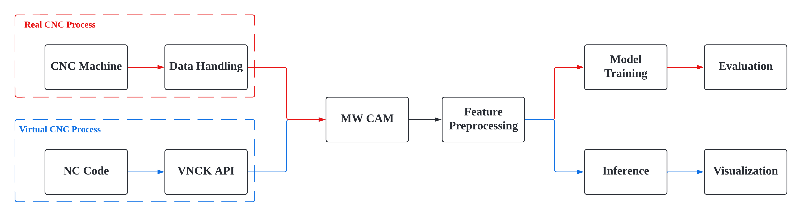
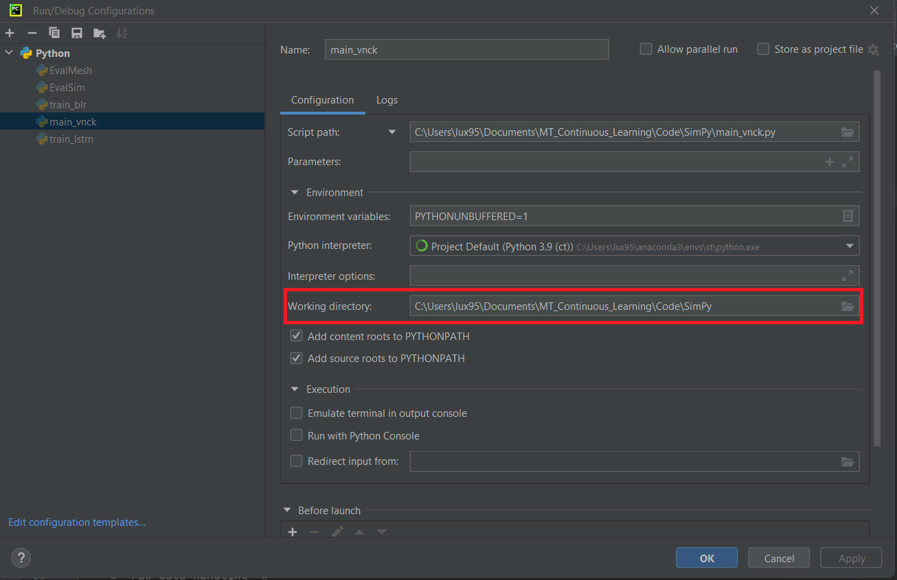

# AICoM-CL

Continual Learning Model for Process Simulation

## Table of Contents
- [Background](#background)
- [Install](#install)
- [Structure](#structure)
- [Usage](#usage)

## Background <a name="background"> </a>
This objective of this project is to develop an adaptive offline process planning system. The system is able to evaluate a machining process in a virtual environment before the real process starts. With the continual learning methods, the model in adaptive process planning system can learn from the new machining process and maintain the knowledge of the previous tasks in the meanwhile  

The system contains two parts. They are continual model learning(red line) and offline process evaluation(blue line). In model learning, the data source comes from the real CNC machining process. The system will decide if the data comes from a new task that model has never learned before. For the new data, model learning process will excited to update the model to adapt the new task. In process evaluation, the input of the system is only the NC program designed by the operator. The VNCK will interpret the NC program and MW CAM will execute the cutting simulation and calculate the engagement analysis. The model will predict the relevant machining parameter, such as spindle current, base on these cutting properties.  

## Install <a name="install"> </a>
For a clean project initialization, please create a new python virtual environment in your application context and install the required 3rd-part libraries in requirements.txt by typing following command in your venv: 
```
pip install -r [YOURPROJECTPATH]/Code/SimPy/requirements.txt
```

## Structure <a name="structure"> </a>
<mark>Simpy </mark> is the core components in this project. It contains some subfolder for different functionalities. 
- **util** folder contains the functions that can handle the raw data, process the feature and train the model.  It also contains the tools to analyze and visualize the raw data and processed features. 
- **model** folder contains scripts for training different models. The scripts in the "base" folder are to train a model only to predict spindle motor current. The "multivariate" folder contains model learning scripts whose targets are extended to the motor current in all axes.  The learned model weights are also stored in the subfolder "save".
- **evaluation** folder contains two scripts to evaluate the generated mesh model and visualize the simulation animation. 
- **demo** folder contains two quick start notebooks to illustrate two aforementioned main parts in the process planning system. 
- **log** folder contains the error messages that occurred in VNCK. 
- **list** folder contains the required configuration for VNCK <span color="red"> please only change the value in this folder if it is necessary </span> 
- **Components** folder contains the default error message lists in VNCK. It is required by VNCK in order to debug the error clearly.

## Usage <a name="usage"> </a>
There are tow main functions in under the "SimPy" folder. The "main_cnc.py" is the main function for model learning and the "main_vnck.py" is the main function for process evaluation. In order to get a correct path relationship, please make sure the current working folder is "[YourProjectPath]/Code/SimPy". 
If you start the script from the Pycharm console, you can set the current working directory in the settings in the following figure: 
